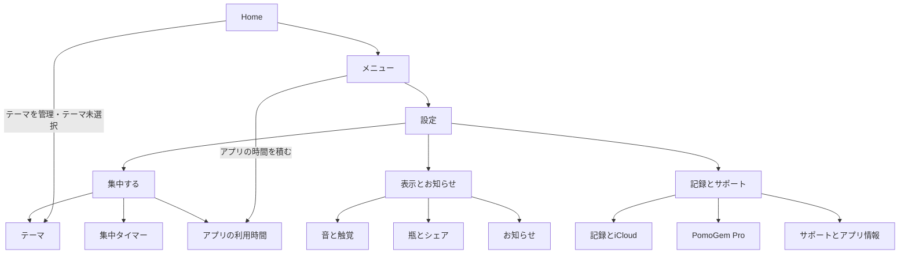

# 設定画面の構造と導線

更新: 2026-10-03。オーナーの「設定画面の導線がわかりづらい」という所見に合わせ、設定を目的別の入口と詳細ページに分ける。

## 改修の目的

旧画面は、テーマ・集中時間・離席時の動作・音・瓶・通知・保存先・サポートを、16 セクションの長い一覧に並べていた。テーマが最大 12 件あり、時間の見本や長い説明も先に表示されるため、保存先やお問い合わせを探すには大きくスクロールする必要があった。

新しい設定トップは 3 グループ・9 入口とする。各入口は、その中でできることを 1 行で説明する。既存の設定項目、現在値、許可状態、利用条件、確認画面は詳細ページに残す。

## 改修前の構造

```text
Home
├─ テーマを管理 → 設定
├─ テーマが必要な操作で未選択 → 設定
└─ メニュー
   ├─ アプリの時間を積む → スクリーンタイム（直接）
   └─ 設定（以下をすべて縦に表示）
      ├─ テーマ
      │  ├─ 各テーマの編集（名前・粒の色・Home への表示）
      │  ├─ 非表示／再表示・並べ替え・削除
      │  └─ テーマを追加
      ├─ 集中
      │  ├─ 既定の集中時間（無料プリセット・カスタム時間）
      │  ├─ 集中タイマーの表示・既定の向き
      │  ├─ タイマー中は画面をロックしない
      │  └─ 集中用の音楽
      ├─ 集中の続き（見出しなし）
      │  ├─ アプリを離れたら一時停止
      │  └─ 集中が切れたらお知らせ（一時停止がオン時）
      ├─ 集中の続き（見出しなし）
      │  ├─ 画面を閉じてもタイマーを表示
      │  └─ 集中に戻るお知らせ（一時停止がオフ時）
      ├─ PomoGem Pro
      ├─ アプリの利用時間 → スクリーンタイム
      ├─ 粒のバリエーション（公開条件が有効時）
      ├─ 音と触覚
      │  ├─ 音・タイマー終了音
      │  ├─ 触覚・タイマー終了時の触覚
      │  ├─ 終了アラームの強さ・許可状態
      │  └─ 終了音と触覚を試す
      ├─ 瓶の表示（演出の強さ・Home の次の目標）
      ├─ 通知（毎日・先月の瓶・通知する時刻・許可状態）
      ├─ シェア（自己申告を含める）
      ├─ iCloud とデバイス／保存方式
      │  └─ 接続・送信の状態・別の iPhone の案内・再確認
      ├─ iCloud と保存先（現在の保存先・変更）
      ├─ 記録の書き出しとリセット
      │  ├─ データの書き出し・進捗・キャンセル
      │  ├─ 表示中の記録をリセット
      │  ├─ iCloud の削除・0 から始める案内
      │  └─ ユーザー内容の削除・未完了時の再試行（公開条件が有効時）
      ├─ サポートとプライバシー
      │  └─ メール・サポート Web・App Store の評価・プライバシー
      └─ このアプリについて
         └─ バージョン・クレジット・ライセンス
```

## 新しい構造チャート



グループ名は一覧の見出しであり、タップする中間ページではない。通常は「設定 → カテゴリ → 操作」の深さで到達する。タイマー表示の見本、音の候補、既存の確認シートなど、選択に必要なページだけをさらに開く。

### 入口の名前と説明

| グループ | 入口 | 入口の説明 |
|---|---|---|
| 集中する | テーマ | 名前・色・表示順 |
| 集中する | 集中タイマー | 時間・画面・離席時の動作 |
| 集中する | アプリの利用時間 | 既存のスクリーンタイム状態を表示 |
| 表示とお知らせ | 音と触覚 | 終了アラーム・効果音・振動 |
| 表示とお知らせ | 瓶とシェア | 瓶の演出・シェアに含める記録 |
| 表示とお知らせ | お知らせ | 毎日のリマインダー・先月の瓶 |
| 記録とサポート | 記録とiCloud | 保存先・同期・書き出し |
| 記録とサポート | PomoGem Pro | 既存の利用中・承認待ち・購入案内を表示 |
| 記録とサポート | サポートとアプリ情報 | 問い合わせ・プライバシー・バージョン |

Home メニューの「設定」の説明は「タイマー・テーマ・通知・データ」とし、設定に含まれる主要な目的を案内する。

### 詳細ページの構造

```text
設定
├─ 集中する
│  ├─ テーマ
│  │  ├─ 一覧・非表示／再表示・並べ替え・削除確認
│  │  ├─ 各テーマ → 編集（名前・粒の色・Home への表示）
│  │  └─ 追加 → 名前・粒の色
│  ├─ 集中タイマー
│  │  ├─ 既定の集中時間 → 無料プリセット／カスタム時間（Pro）
│  │  ├─ 集中タイマーの表示
│  │  │  └─ リング＋時間／円盤（数字なし）／時間のみ／リングのみ
│  │  ├─ タイマーの既定の向き → 自動／上／右／下／左
│  │  ├─ タイマー中は画面をロックしない
│  │  ├─ 集中用の音楽 → 既存の音楽シート
│  │  │  └─ Apple Music の状態・音楽の選択・再生操作・自動再生
│  │  ├─ アプリを離れたら一時停止
│  │  ├─ 集中が切れたらお知らせ（一時停止がオン時）
│  │  ├─ 画面を閉じてもタイマーを表示
│  │  └─ 集中に戻るお知らせ（一時停止がオフ時）
│  └─ アプリの利用時間 → 既存のスクリーンタイムページ
│     ├─ アクセス状態・許可・問題の案内
│     ├─ アプリの利用時間を記録
│     ├─ 勉強アプリの選択・記録先テーマ・Pro 案内
│     ├─ 控えたいアプリの選択・黒い石の累計・片付け
│     ├─ 集中中のアプリ制限・解除
│     ├─ 記録について
│     ├─ スクリーンタイムの内容をリセット
│     └─ 保存・未保存時の保存／破棄して戻る
├─ 表示とお知らせ
│  ├─ 音と触覚
│  │  ├─ 音・タイマー終了音の選択
│  │  ├─ 触覚・タイマー終了時の触覚の選択
│  │  ├─ 終了アラームの強さ・必要な許可状態
│  │  └─ 終了音と触覚を試す
│  ├─ 瓶とシェア
│  │  ├─ 演出の強さ・Home に次の目標を表示
│  │  ├─ 粒のバリエーション（公開条件が有効時）
│  │  │  └─ レア粒の選択・未選択時の確定・各粒の説明
│  │  └─ シェアに自己申告を含める
│  └─ お知らせ
│     ├─ 毎日のリマインダー
│     ├─ 先月の瓶のお知らせ
│     ├─ 通知の許可状態・許可／設定を開く
│     └─ 通知する時刻（どちらかがオン時）
└─ 記録とサポート
   ├─ 記録とiCloud
   │  ├─ 保存方式・接続／送信の状態
   │  │  └─ 別の iPhone の案内・再確認・必要時の設定への案内
   │  ├─ 現在の保存先・変更 → 既存選択シート
   │  │  ├─ iCloud 時：この iPhone へ引き継ぐ・iCloud から再取得
   │  │  ├─ 端末保存時：残すデータを選んで iCloud を有効にする
   │  │  └─ プレビュー・利用不可の説明・最後の確認
   │  ├─ データの書き出し
   │  │  └─ 書き出す・進捗・キャンセル・共有／保存先選択
   │  └─ リセットと削除（ページ末尾）
   │     ├─ 表示中の記録をリセット・利用条件・確認
   │     ├─ iCloud のデータ削除・0 から始める案内
   │     └─ ユーザー内容の削除・未完了時の再試行（既存公開条件）
   ├─ PomoGem Pro → 既存の購入・復元シート
   └─ サポートとアプリ情報
      ├─ メールで問い合わせる → 下書き
      ├─ サポートページ → Web
      ├─ App Store で評価・レビュー → App Store
      ├─ プライバシーポリシー → Web
      └─ このアプリについて
         └─ バージョン・著作権・書体・フォント／ソースのライセンス
```

## 配置の理由

- **使う目的から探す**：テーマとタイマーを先頭に置き、見た目や通知、データとサポートをそれぞれ同じ場所にまとめる。
- **離席の動作と通知を一緒に読む**：一時停止のオン／オフによって通知の種類が切り替わるため、両方を集中タイマーに残す。「お知らせ」は毎日・毎月の継続の通知を扱う。
- **終了アラームを見つけやすくする**：音・触覚・終了アラームは「音と触覚」にまとめる。通知時刻や月の振り返りを探す人とは目的が異なるため、別の入口とする。
- **保存と整理の場所を一つにする**：保存先、iCloud の状態、端末間の引き継ぎ、書き出しは「記録とiCloud」に置く。接続状態と、全記録の同期完了は区別して表示する。
- **書き出しと削除を分ける**：安全な保存操作は「データの書き出し」、取り消せない操作は末尾の「リセットと削除」に置く。利用不可の理由と既存の確認は保持する。
- **直行できる導線を残す**：Home の「テーマを管理」やテーマ未選択時はテーマページへ、Home の「アプリの時間を積む」はスクリーンタイムへ直接開く。

## 戻る動作と保存

- 設定トップから開いた詳細ページは「設定」へ戻り、設定からは Home へ戻る。
- Home からテーマページへ直接開いた場合も、その上に設定トップを置き、戻る先とページの所属を明確にする。
- Home から直接開くスクリーンタイムは既存どおり Home へ戻る。設定トップから開いた場合は設定へ戻る。
- 即時に反映する設定は既存どおり。テーマ編集やスクリーンタイムの下書きは既存の保存・キャンセル・未保存確認を使う。
- 画面を開くだけで設定値、記録、権限、購入状態、保存先を変更しない。
- カテゴリを開く・戻る操作でも、表示中の画面で必要な通知処理や試聴、書き出しのライフサイクルを維持する。

## 実装の参照先

- `PomoGem/Features/Settings/SettingsView.swift`：入口・カテゴリ・既存項目・確認画面。
- `PomoGem/App/AppRouter.swift`、`PomoGem/App/RootView.swift`：設定トップとカテゴリへの経路。
- `PomoGem/Features/Home/HomeView.swift`：メニューとテーマへの直行。
- `PomoGem/Features/Settings/ScreenTimeSettingsView.swift`：権限・下書き・保存・未保存時の戻る確認。
- `PomoGem/Core/CloudSyncMonitor.swift`、`PomoGem/Features/Settings/StorageTransferSettingsSection.swift`：iCloud と保存先の表示・確認。
- `PomoGem/Localization/Settings.xcstrings`、`PomoGem/Localization/Home.xcstrings`：日英の入口名と説明。
