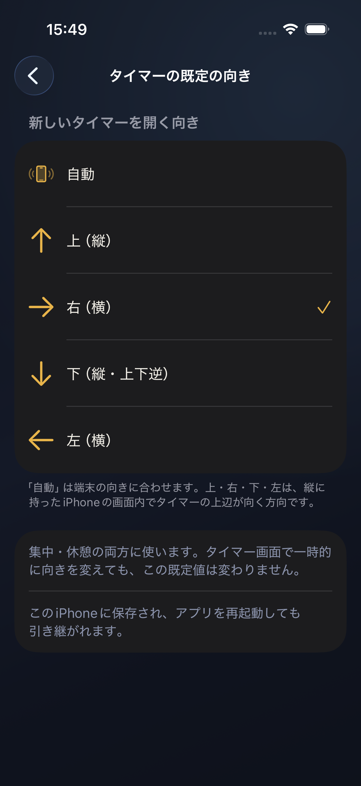
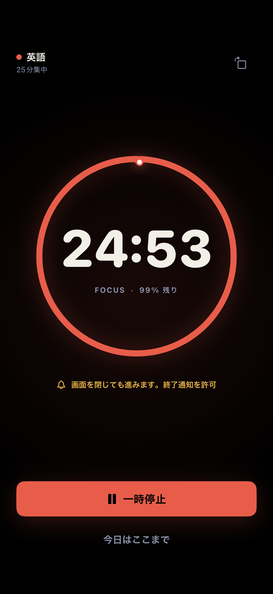
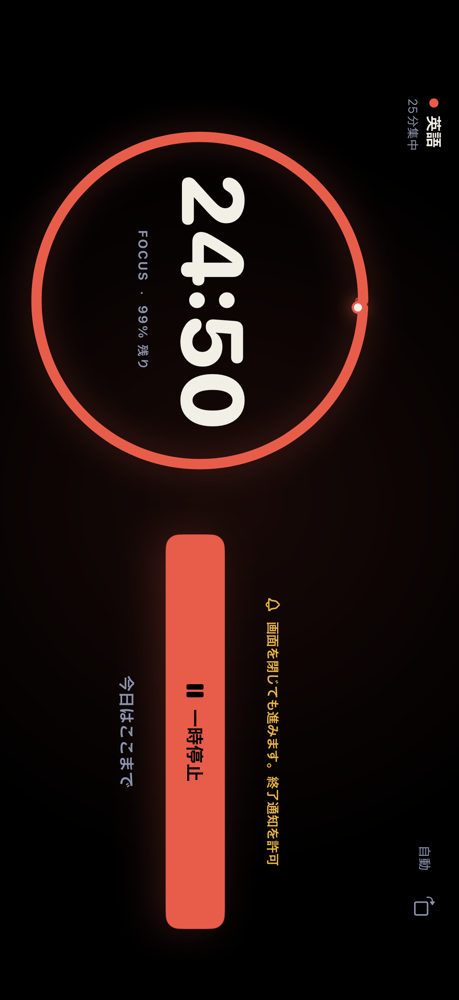
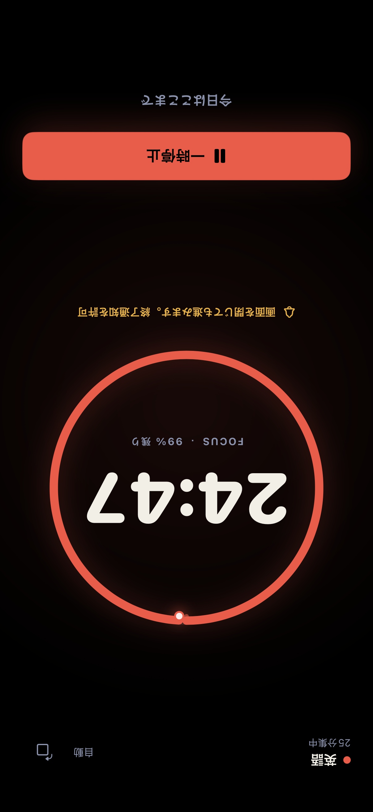
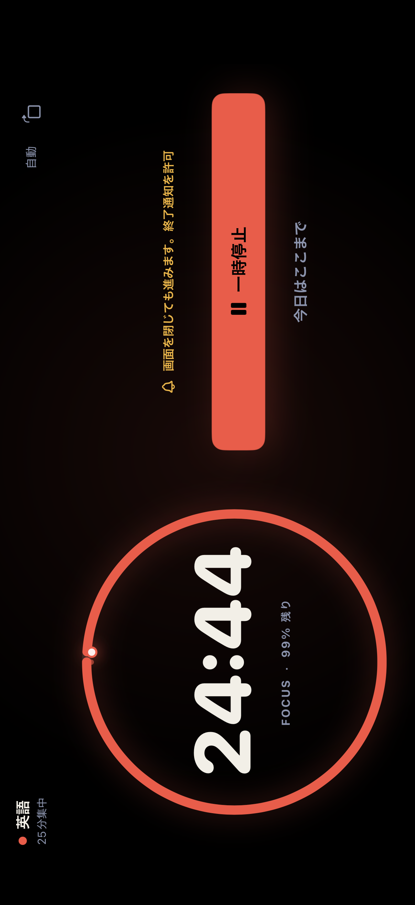
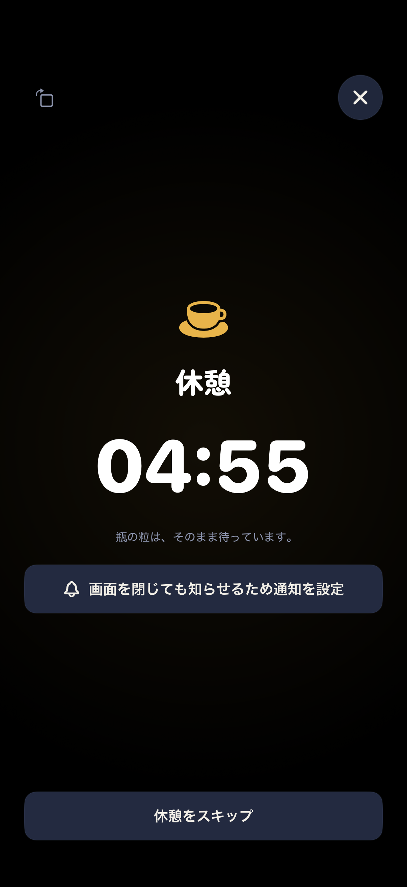
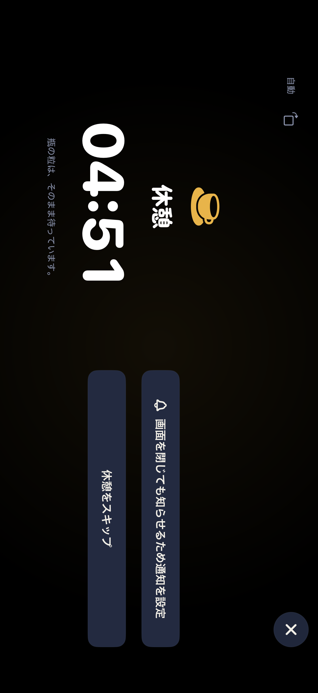
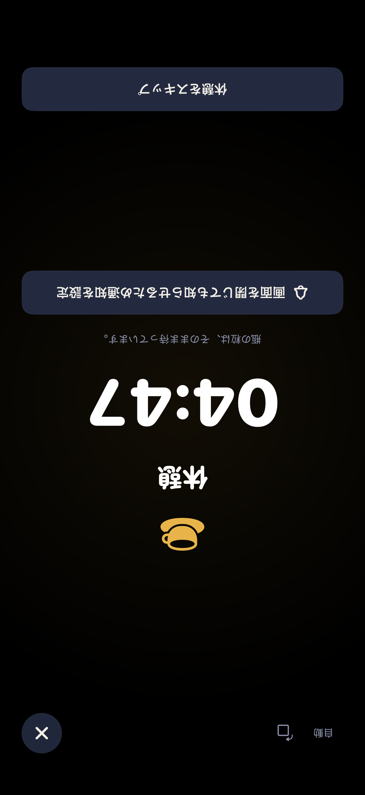
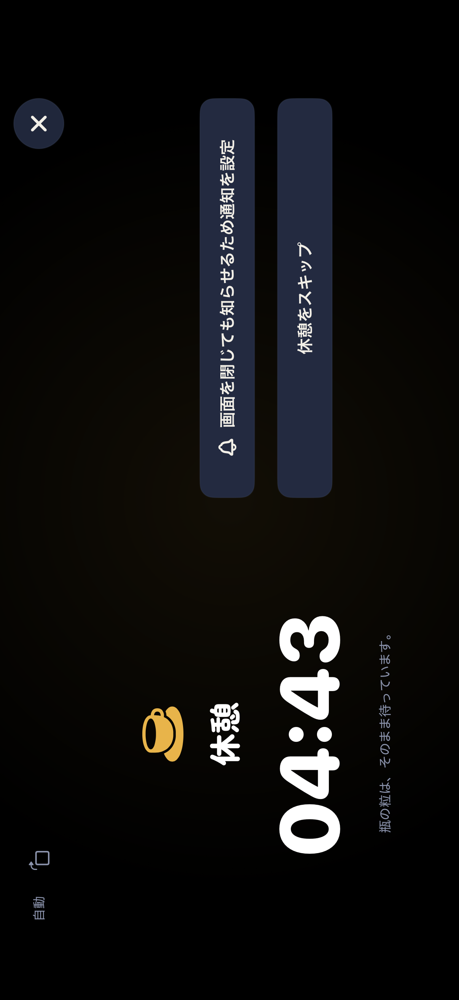

# タイマーの4方向レイアウト

集中・休憩タイマーは、上・右・下・左の4方向で表示できます。初期設定の「自動」では端末の向きに合わせて回転します。
縦向きは時計と操作を縦に並べ、横向きは時計と操作を左右に並べます。
アクセシビリティ文字サイズでは縦並びとスクロールを使い、全文と操作へ到達できるようにします。

設定 → 集中 → 「タイマーの既定の向き」で、自動／上／右／下／左を選べます。
上・右・下・左を選ぶと、その向きに固定して始まります。新しい集中・休憩タイマーを開始するときと、
終了したアプリを再起動したときに、保存した既定の向きを適用します。

回転アイコンを押すと、上 → 右 → 下 → 左の順に切り替わります。アイコンは控えめな色で、
タップ領域は44 × 44ptです。タイマー中の手動選択と「自動」への切替は、設定の既定値を変更しません。
この一時的な選択は同じタイマーの実行中だけメモリに保持し、iCloudの確認に伴う画面の再生成を
またいで引き継ぎます。集中から休憩へ進む場合を含め、新しいタイマーは既定の向きから始まります。
端末を机に置いたときや向きを判定できないときは、最後の向きを保ちます。
回転は残り時間・一時停止・終了通知・記録へ影響しません。

既定の向きだけをこのiPhoneのUserDefaultsに保存し、iCloud同期やJSON書き出しには含めません。
通常の「表示中の記録をリセット」では保持し、アプリ削除時には消去されます。
内部の完全削除処理でも、ほかのUserDefaults設定とともに消去します。



## システムの向きと互換性

- iOS 26以降は表示中のwindow sceneの公開API
  [`isInterfaceOrientationLocked`](https://developer.apple.com/documentation/uikit/uiwindowscene/geometry/isinterfaceorientationlocked)
  を参照し、ロック中は端末通知による自動切替を抑止します。
- iOS 17/18には同じ公開照会APIがないため、UIKitが通知する端末の向きに追従します。
  手動切替は全対応OSで利用できます。Control Centerの回転ロックと通知の組合せは実機確認が必要です。
- ロック状態やセンサ通知の有無にかかわらず、手動操作へ到達できるよう回転アイコンを常設します。
- 上・右・左では、公開APIの
  [`requestGeometryUpdate`](https://developer.apple.com/documentation/uikit/uiwindowscene/requestgeometryupdate(_:errorhandler:))
  を使い、タイマーの向きに合わせてwindow scene自体を回転します。ホームインジケータ、
  システムジェスチャーの端、確認ダイアログもそのシーンの向きを使います。
- 下はシステムへ上下逆表示を要求し、対応しない端末では通常の縦向きに戻してタイマーの内容だけを180度回転します。
  ホームボタンのないiPhoneは上下逆表示に対応しないため、この向きではシステムUIの端は反転しません。
  [Apple: supportedInterfaceOrientations](https://developer.apple.com/documentation/uikit/uiviewcontroller/supportedinterfaceorientations)
- レイアウトは実際のシーンの安全領域と向きを使い、タイマーの指定方向との差だけを補正します。
  横向きのシーンで内容をさらに90度回転させたり、幅と高さを二重に交換したりしません。
- Control Centerや通知センターによる一時的な非アクティブ化ではシーンの向きを保持します。
  集中の完了画面（終了アラート中を含む）もタイマーの一部として同じ向きを保ち、横向きでは
  記録と状態を左右に並べます。タイマーを閉じたときだけ縦へ戻し、Home・設定は通常の縦向きで表示します。
  画面の再生成時は、前のタイマーの遅延した復元処理が新しいタイマーの向きを上書きしないようにします。
- UIKitの端末方向通知は表示中かつアクティブな間だけ購読し、非アクティブ化・画面の破棄で停止します。
  端末から届く向きとタイマー中の一時的な手動選択はメモリだけに保持します。
  新しい権限要求、CloudKit同期、外部送信はありません。
  [Apple: beginGeneratingDeviceOrientationNotifications](https://developer.apple.com/documentation/uikit/uidevice/begingeneratingdeviceorientationnotifications())

## レイアウト画像（2026-09-09時点）

以下はシーン全体の回転へ変更する前の内容回転方式の記録です。
現在の横向きではホームインジケータも横画面の下辺へ移り、安全領域に応じてレイアウトが調整されます。

日本語・iPhone 17 Pro / iOS 26.5 Simulatorの実画面です。テスト専用の空の保存領域と初期テーマ
「英語」を使用しています。写真加工・合成はしていません。
画像は端末を縦に固定して手動で切り替えたときの向きをそのまま収録しています。
上・右・下・左は、画面内でタイマーの上辺が向く方向です。

この文書で参照する画面画像9枚は、Simulatorの実UIをXCTest添付として収録したものです。
本プロジェクトが保有する画像の権利は[MIT License](../LICENSE)で許諾します。
個別のファイル名・出所・SHA-256は[画像台帳](../ASSET_LICENSES.md)に記録しています。

| 上（縦） | 右（横） |
|---|---|
|  |  |
| 下（縦・上下逆） | 左（横） |
|  |  |

| 休憩・上 | 休憩・右 |
|---|---|
|  |  |
| 休憩・下 | 休憩・左 |
|  |  |

## 再検証

2026-09-09に署名なしのSimulator buildと以下の検証を実施しました。

| 環境 | 結果 |
|---|---|
| iPhone 17 Pro、iOS 26.5、402 × 874pt | 単体677件（明示opt-inの40年保存soak 1件を除外）、失敗0。回転追加時のUIテスト5件成功 |
| 既定値追加後のiPhone 17 Pro | UIテスト5件成功。設定の5択・再起動後の保持・新しい集中／休憩への適用・一時的な回転との分離・AX5での設定操作を確認し、自動4方向と一時停止／自動復帰を再検証 |
| iPhone SE（第3世代）、iOS 26.5、375 × 667pt | 手動4方向と最大文字サイズのUIテスト2件成功。最大文字サイズの休憩は通常表示から開始し、再起動で同じ休憩を復元して検証 |
| リポジトリ検査 | `check-oss-readiness.sh --current`、`validate-site.py`、`xcodegen generate`、`git diff --check`成功 |

`TimerOrientationTests`は方向対応、ロック時の抑止、手動保持と自動復帰、回転角の短い補間、
安全領域、画面を再生成した場合の向きの継承を検証します。
シーンの実際の向きとの組合せ、UIKitの左右対応、二重回転を避ける補正も検証します。既定値の保存、未設定・不正値の
自動への復帰、新しいタイマーへの適用、一時的な選択との分離、完全削除後の初期値も検証します。
`TimerOrientationUITests`は実際の端末方向通知、手動4方向、稼働中・停止中の残り時間、
休憩、最大文字サイズ、Reduce Motion、瓶への復帰を検証し、画面画像をXCTest添付として残します。
方向のラベルだけでなく、実際のwindowの縦横とUIWindowSceneの向き、確認ダイアログの表示中の向き、
横向きでタイマーを閉じた後のHomeの縦復帰を検証します。
既定値設定の5択、アプリ再起動での保持、集中から休憩へ進むときの既定値適用、
最大文字サイズでの設定操作にも対応しています。
ロック分岐のUIテストはDebug専用の入力であり、実機のControl Center操作を検証したものではありません。

```sh
xcodegen generate
xcodebuild -project PomoGem.xcodeproj -scheme PomoGem \
  -destination 'platform=iOS Simulator,name=iPhone 17 Pro' \
  -parallel-testing-enabled NO \
  -only-testing:PomoGemTests/TimerOrientationTests \
  -only-testing:PomoGemUITests/TimerOrientationUITests \
  test CODE_SIGNING_ALLOWED=NO COMPILER_INDEX_STORE_ENABLE=NO
```

実機で残る確認は、iOS 26とiOS 17/18それぞれでControl CenterのロックON/OFF、
4方向の傾き、机に置く操作、VoiceOverの読み上げと回転後の操作位置です。
