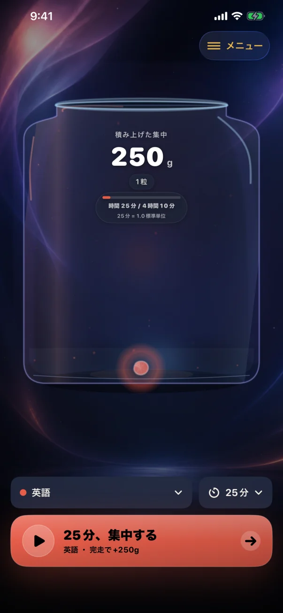

# ポモジェム

集中時間を「質量」に変え、物理演算の粒として瓶へ積み上げるiPhoneアプリです。
25分・45分・60分・90分のタイマー、記録、瓶、選択式のiCloud同期は基本無料で利用できます。
それ以外の任意の1〜360分と、まとまり粒の月刻印は、1回限りのアプリ内課金
「ポモジェムPro」で解放します。シェアカードには、プランにかかわらずポモジェムのロゴと
公式サイトを表示します。

PomoGemは新しいアプリとしてリリース準備中です。App Store・IAP・CloudKitの識別子を新設し、
以前の開発版のデータや購入権利は自動移行しません。公開先と未完了のrelease gateは
[App Store設定](AppStore/configuration.yml)と[リリース手順](Docs/RELEASING.md)で管理します。



## 主な機能

- 1分を10gとして積み上げる25分／45分／60分／90分の集中タイマー
- 集中・休憩タイマーを端末の向きに合わせて上下左右に表示。設定で既定の向きを自動／上／右／下／左から選び、タイマー中も回転ボタンで切替可能（[設定・レイアウト画像と対応範囲](Docs/TimerOrientation.md)）
- SpriteKitの瓶、質量に応じた粒、タップ位置の局所衝撃、iPhoneの傾きに連動する重力
- 勉強と仕事を分けない一つの一覧で、テーマを追加・編集・並べ替え・削除
- Homeの選択欄でテーマと集中時間を選び、開始ボタンのtapで集中を開始
- 100点、試験合格、納品などを質量0gの「成果の石」として保存
- 10個ずつ融合する可動結晶と、40年規模でも小さな積み重ねを失わない俯瞰表示
- 初回に同格のiCloud同期／このiPhoneのみから保存先を明示選択。このiPhoneのみならApple Account／networkなしで全基本機能を利用
- iCloudを選び確認した場合、private CloudKitでtheme名、成果memo、記録、設定、進行中timerを同じApple Accountの対応iPhone間で同期。瓶用の集約は各端末で再構築
- テーマ名を含めないローカル通知と、利用者データを表示せずアプリを開くホーム／ロック画面ウィジェット
- 集中時間と状態だけを表示し、テーマ名・メモ・アカウント情報を含めないロック画面Live Activity
- 瓶と累計質量を静止画または短いGIFとして共有
- 端末で利用可能な全11種類の出荷対象保存データをversioned JSONとして手動で書き出し。ただしVersion 1.0は再import／保存先migrationに非対応
- 広告、追跡、解析SDK、自前の収集サーバーなし

継続設計の目的は、アプリへの依存や滞在時間を増やすことではありません。本人の
選択、正確な時間価値、休憩、長期的に戻りやすいことを優先します。詳しい設計契約は
[EngagementArchitecture.md](Docs/EngagementArchitecture.md)を参照してください。

## 対応環境

- iPhone（iOS 17以降）
- Xcode 26以降とiOS 26 SDK（現在のApp Store提出要件）
- XcodeGen 2.45.4

iPad専用UI、Mac、Mac Catalystには対応していません。

## 開発を始める

```sh
brew install xcodegen
xcodegen generate
open PomoGem.xcodeproj
```

`PomoGem`スキームとiPhoneシミュレータを選び、Runします。署名なしSimulatorは
CloudKitへ接続せず、専用のローカル永続ストアを使います。iCloud、通知、
モーション、StoreKit、Live Activityの最終確認は実機で行ってください。Version 1.0のWidgetは
account-neutralな起動導線だけを表示します。Live Activityもaccount-neutralとし、明示的に集中を
始めたときだけ、アプリ名、選択時間、残り時間、実行状態を表示します。テーマ名、メモ、質量、
Apple Account、CloudKit由来の内容は渡しません。設定から端末ごとに無効化でき、更新に独自serverや
ActivityKit pushを使いません。

`project.yml`がXcodeプロジェクト設定の正本です。変更後は`xcodegen generate`を実行し、
生成された`PomoGem.xcodeproj`も同じ変更としてコミットします。

## 検証

```sh
./Scripts/check-oss-readiness.sh
python3 Scripts/validate-site.py
xcodegen generate
xcodebuild \
  -project PomoGem.xcodeproj \
  -scheme PomoGem \
  -destination 'generic/platform=iOS Simulator' \
  -derivedDataPath DerivedData-CI \
  build CODE_SIGNING_ALLOWED=NO COMPILER_INDEX_STORE_ENABLE=NO
```

通常のPRでは署名なしSimulator buildとunit testを行います。40年分を実保存するsoakと
永続UI fixtureは`DEBUG`かつ明示的なテスト用環境変数でのみ有効で、Releaseには入りません。

## Appleサービスの設定

公式版は次の公開識別子を使います。これらは秘密情報ではありませんが、forkから公式版の
CloudKit、App内課金へ接続する権限は付与されません。

| 用途 | 公式版の識別子 |
|---|---|
| App bundle | `com.hinoshiba.pomogem` |
| Widget bundle | `com.hinoshiba.pomogem.widgets` |
| SwiftData同期用CloudKit container | `iCloud.com.hinoshiba.pomogem` |
| Non-Consumable IAP | `com.hinoshiba.pomogem.pro.lifetime` |

Version 1.0では、Apple Account切替時の安全境界を実機で証明できていないレア抽選台帳と、
アプリ内からのCloudKit一括削除を出荷経路から無効化しています。通常のtheme名、成果memo、集中記録、
設定、進行中timerのprivate iCloud同期は、初回にiCloudを選択して確認した場合だけ有効です。選択時と
各launch／resumeでonlineのApple Account確認を行い、別account／通信不可では保存済みdataを消さず
fail closedにします。「このiPhoneのみ」はiCloudへ自動switch／uploadせず、Apple Account／networkなしで
利用できます。保存先はVersion 1.0では変更できず、app削除・再installでlocal記録は失われ、JSONは
再importやmigrationには使えません。

iCloudの画面公開前には、サーバーで観測したリセット履歴以上の世代が端末へ届いていることも
期限付きで確認します。全記録の同期完了を待つ機能ではありません。iCloud選択時の「表示中の記録を
リセット」は記録保護のため一時的に利用できず、local-onlyでは引き続き利用できます。

「保存領域を確認できません」などのエラーの原因と実機確認手順は、
[iCloud同期のトラブルシューティング](Docs/iCloudSyncTroubleshooting.md)を参照してください。

署名に使うApple Developer Teamはリポジトリへ固定せず、Xcodeのローカル設定または
`xcodebuild DEVELOPMENT_TEAM=<Team ID>`で指定します。forkを配布する場合は`project.yml`、
`Shared/IntegrationConstants.swift`、
`PomoGem/Core/CloudSyncMonitor.swift`、entitlements、StoreKit設定、Web URLを自分の
識別子へ置き換えてください。製品名、アイコン、マーケティング画像も
[商標・ブランド方針](TRADEMARKS.md)に従って置き換える必要があります。

証明書、秘密鍵、`.p12`、provisioning profile、App Store Connect API key、Keychain、
署名済みarchiveはリポジトリへ追加しません。公式版のローカルArchiveとApp Storeへの
アップロードは[リリース手順](Docs/RELEASING.md)を正本とします。

## GitHub Pages

`http_dists/`はビルド不要の静的サイトです。Pagesの公開元をGitHub Actionsにすると、
`main`へのサイト関連ファイルのpush時に公開前検査を行い、そのフォルダだけを自動配信します。
必要に応じてActions画面から手動実行もできます。Pagesは公式repository IDで実行先を制限し、
repositoryの改名前後で同じ配信先を使用します。GitHub repositoryは現在privateで、ユーザーによる改名と
公開確認が残っています。WebにはソースへのGitHubリンクを掲載していますが、repositoryの公開まではアクセス権が必要です。
製品サイトは日本語・Englishを同じページで切り替え、案内とポリシーへアンカーで移動します。

- 製品サイト: <https://pomogem.hinoshiba.com/>
- 製品サイト（English）: <https://pomogem.hinoshiba.com/?lang=en>
- Privacy Policy: <https://pomogem.hinoshiba.com/#privacy>
- Support: <https://pomogem.hinoshiba.com/#support>

URLを変える場合は、Webのcanonical/OG、`.github/workflows/pages.yml`、`project.yml`、
`PomoGem/App/AppLinks.swift`、App Store metadataを同時に更新してください。

## OSS運用

- 不具合・機能提案: GitHub Issues
- 脆弱性・プライバシー漏えい: [SECURITY.md](SECURITY.md)の非公開手順
- コントリビューション: [CONTRIBUTING.md](CONTRIBUTING.md)
- データフロー: [PRIVACY.md](PRIVACY.md)
- 初回公開手順: [OSS_PUBLISHING.md](Docs/OSS_PUBLISHING.md)
- 商用配布ライセンス監査: [LICENSE_AUDIT.md](Docs/LICENSE_AUDIT.md)

## ライセンス

| 対象 | 条件 |
|---|---|
| ソースコードと通常文書 | [MIT License](LICENSE) |
| Zen Maru Gothic | SIL Open Font License 1.1（[LICENSE-fonts.txt](LICENSE-fonts.txt)） |
| 「ポモジェム」「PomoGem」の名称、ロゴ、アプリアイコン、生成背景、Store／Web向けマーケティング画像 | MIT対象外。Copyright 2026 hinoshiba. All rights reserved. |

同梱された未改変のブランド素材は、このリポジトリの取得・fork、ローカルでのbuild／test、
CI、code review、contributionに必要な範囲に限り保持・複製できます。この限定許諾は、素材を
含むアプリ、Webサイト、配布package、公開build artifactの再配布や、公式版と誤認させる
利用を許可するものではありません。改変版アプリを配布する前に、ブランド素材を自作物へ
置き換えるか、権利者の書面による許可を得てください。

適用範囲と開発用の限定許諾は[ASSET_LICENSES.md](ASSET_LICENSES.md)、名称・表示の扱いは
[TRADEMARKS.md](TRADEMARKS.md)、その他の利用物は
[THIRD_PARTY_NOTICES.md](THIRD_PARTY_NOTICES.md)を参照してください。
